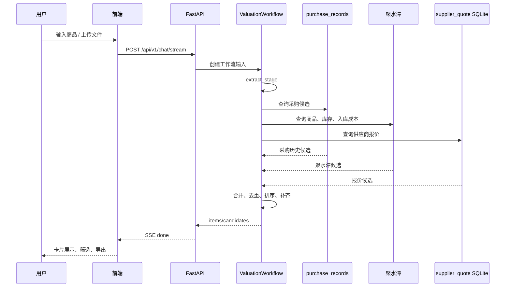

# QuickQuote 后端流程图

更新日期：2026-06-23

## 节点说明

`extract_stage`：

- 解析商品信息。
- 支持 LLM 和规则兜底。

`multi_source_match_stage`：

- 三源并行召回。
- 单源失败不终止整个流程。

`purchase_route_stage`：

- 采购历史补齐。
- 聚水潭库存/成本补齐。
- 动态成本补齐。

`result_stage`：

- 输出最终结构。
- 保存上下文和归档。
